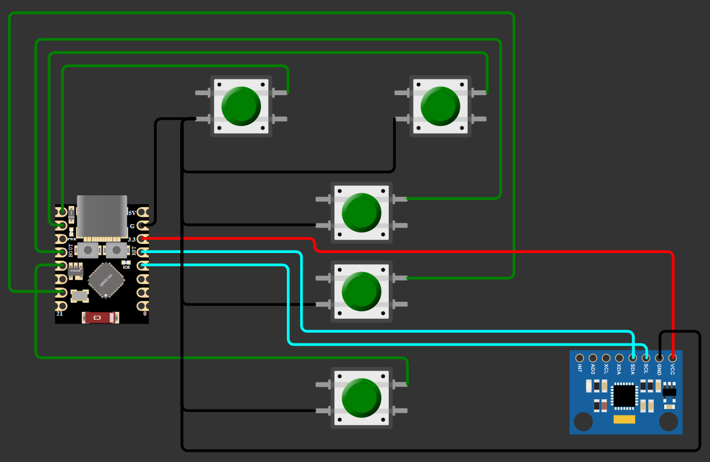
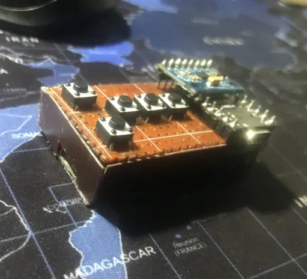
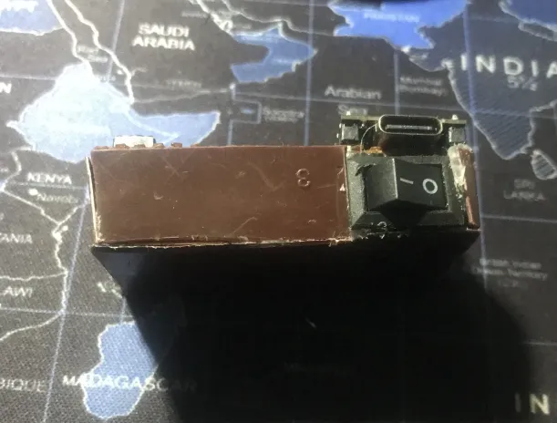

# ESP32-C3 Air Mouse

A Gyroscope Based Mouse Built Using the Esp32 C3 Super mini and the MPU6050

.webp)

## Hardware

| Component | Notes |
|---|---|
| ESP32-C3 Super Mini |
| MPU6050 | 
| 5x momentary push buttons |

## Wiring

| Signal | ESP32-C3 Pin |
|---|---|
| Left click | GPIO5 |
| Right click | GPIO6 |
| Middle click | GPIO20 |
| Scroll up | GPIO8 |
| Scroll down | GPIO9 |
| MPU6050 SDA | GPIO4 |
| MPU6050 SCL | GPIO3 |
| MPU6050 VCC | 3V3 |
| MPU6050 GND | GND |

# Simple Wiring Diagram

## Libraries

Install via the Arduino IDE Library Manager:

- [NimBLE-Arduino](https://github.com/h2zero/NimBLE-Arduino) (by h2zero) — v2.3.x or newer

The MPU6050 is read directly over raw I2C registers, so no separate MPU6050 library is required.

## Flashing

1. Install the ESP32 board package and select your ESP32-C3 board in the Arduino IDE.
2. Install NimBLE-Arduino from the Library Manager.
3. Wire everything per the table above.
4. Open the `.ino` file and flash it to the board.
5. Open Serial Monitor at `115200` baud to watch calibration/connection status.

## Pairing

Once flashed, the board shows up as **"ESP32 Air Mouse"**. Pair it from your computer or phone's Bluetooth settings like any other Bluetooth mouse.

## Troubleshooting

- **MPU6050 not found at boot:** double-check wiring against the table above, particularly SDA/SCL.
- **Cursor doesn't move after reconnecting** (but worked on first pair): make sure the board is running the version with the security/encryption handshake in `onConnect`/`onAuthenticationComplete` — older revisions of this sketch could connect without properly completing BLE encryption, which silently blocked HID reports.
- **Choppy/jumpy cursor:** check `smoothFactor` and `MOTION_SEND_INTERVAL_MS` first. If it persists, check your OS's mouse settings (e.g. "Enhance pointer precision" on Windows).

## Photos

  
  

